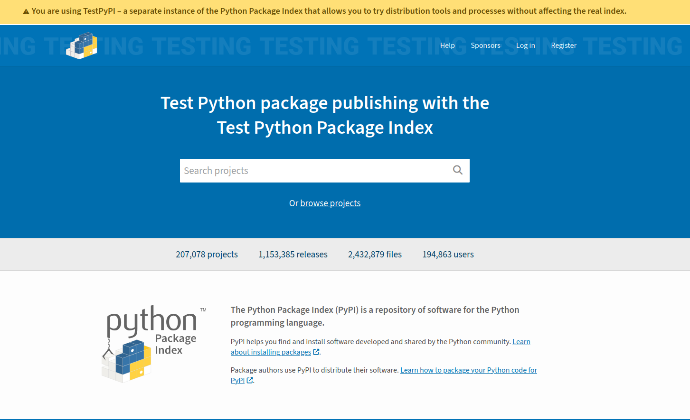
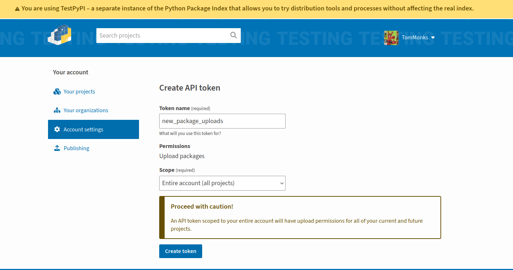

# Publish a package on PyPI

The first thing to say is that **there is a PyPI test site!**  It is called [TestPyPI](https://testpypi.python.org) and is incredibly helpful and I recommend you make use of it while learning instead of the main PyPI site.  I found that I made several mistakes the first time I attempted publication (and still do with new packages!).  The great thing about TestPyPI is that once your package is published you can install it, just like you would if it were on the production PyPI site.

```{admonition} pyOpenSci.org: An (excellent) alternative guide to PyPI
:class: information, dropdown
While I was updating version 3 of this book I came across an excellent easy to follow guide to python package publishing on PyPI [available on pyopensci.org](https://www.pyopensci.org/python-package-guide/tutorials/publish-pypi.html). Its another good source of information if you want a different perspective.
```
##  IMPORTANT: Use a unique package name

Before you proceed any further I recommend visiting PyPI and TestPyPI searching for your package name.  You might find a package with an identical name.  If an identically named package exists then you need to **rename your package, before attempting any of the steps outlined in this section**.  

In the past I have also regretted using a similar name to existing packages. Don't make the same mistakes as me! Keep things simple for yourself: make your package name distinctive.

If you do rename your package then make sure you must update the following:

1. The `pyproject.toml` meta-data
2. The package directory
3. The GitHub repository

## Setting up TestPyPI

### Get a TestPyPI account

You need to go to https://test.pypi.org and create an account.  You should be greeted by a webpage similar to the below. Note that the banner that is making clear you are on the test site.  As part of the account creation process you will be required to setup two factor authentication.



### API Tokens

Rather than use your username and password to upload to TestPyPI you need to use an **API token**.  Tokens come in two levels of scope: 

* **account wide**: an API token scoped to your entire account will have upload permissions for all of your current and future projects.
* **project specific**: this is self explanatory an API token that allows uploads of a specific package.

There's a catch to this framework!  You can only create a project specific token for an existing project.  This means that for a new package you need to use an account wide token.  Once the package is uploaded you can then create the project specific token.

To create a token head to account settings and select **Create API token**.  You should be presented with a page similar to the below. I've selected account wide token and chosen the name "new_package_uploads" so that its use is clear.  Click on **Create Token**



You will then be shown the generated token. **IMPORTANT** - you need to save this token to a very safe place. You won't be shown it again and you don't want to share it with others as it can access all projects in your account.  The token will take the following form: `pypi-[random string]`

### Including source and wheel distributions

It is recommended that you include both a **source** and **wheel** distribution in your python package on pypi. Wheels are an advanced topic and it took me a while to get my head around what a wheel distribution actually is and why it is useful!  A nice phrase I came across is that '*wheels make things go faster*'

* A source is just what you think it is.  It is your source code!

* A wheel (.whl) is a ready-to-install python package i.e. no build stage is required. This is very useful for example if you have written custom C or Rust extensions for python. The wheel contains your extensions compiled and hence skips the build step.  Wheel's therefore make installation more efficient.  

> You can create universal wheel's i.e. applicable to both python 2 and 3 or pure python wheels i.e. applicable to only python 3 or python 2, but not both.

To install wheel use

```bash
$ pip install wheel
```

To produce the source and the wheel run 

```bash
$ python setup.py sdist bdist_wheel
```

* Now take a look in ./dist.  You should see both a zip file containing the source code and a .whl file containing the wheel.

A .whl file is named as follows:

```
{dist}-{version}-{build}-{python}-{abi}-{platform}.whl
```

For additional information on wheels I recommend checking out [https://realpython.com/python-wheels/](https://realpython.com/python-wheels/)

### Using twine and testpypi

To publish on pypi and testpypi we need to install an simple to use piece of software called `twine`

```bash
$ pip install twine
```

It is sensible to check for any errors before publishing!  To do this run the code below

```bash
$ twine check dist/*
```
This will check your source and wheel distributions for errors and report any issues.

> Before you push to testpypi you need to have a unique name for your package!  I recommend making up your own name, but if you are feeling particularly unimaginative then use `pypi_template_{random_number}`. Set this in `setup.py`. **Check if it has been created and exists on testpypi first!**

To publish on testpypi is simple.  The code below will prompt you for your username and password.

```bash 
$ twine upload --repository-url https://test.pypi.org/legacy/ dist/*
```

If this uploads successfully you can then `pip` install from testpypi as follows.  The URL for your package is available on the project page for testpypi.

```bash
$ pip install -i https://test.pypi.org/simple/{your_package_name}==0.1.0
```

### Publish on pypi production

First I just want to say that you shouldn't really publish on the main production pypi site for unless you need to.  Use it when necessary to help your own research, work or colleagues, but not for testing purposes: use testpypi instead.  **You will need a separate account for PyPI.**.  If you intend to publish to pypi I recommend searching the index first in order to identify any potential name clashes.  

When you are ready you can upload use `twine`

```bash
$ twine upload dist/*
```

## Building publishing into your workflow with GitHub Actions

The manual steps I've outlined here are somewhat historical.  Most modern projects make use of version control in the cloud such as GitLab or GitHub.  These include ways to automatically publish updates to pypi.  One such way is with GitHub actions.  For example, I use **the publish to pypi action** when code is merge into the 'main' branch.

To set this up you will need to supply GitHub with a username and password for pypi.  Its stored securely, but you may rightly have concerns about privacy and security. My approach has been to create a secondary maintainer account for pypi rather than storing my main PyPI credentials to GitHub. I will leave it up to you to make a decision about if you feel this is necessary.  It can always be updated at a later date.

You can read more about Github actions [here](https://docs.github.com/en/actions)